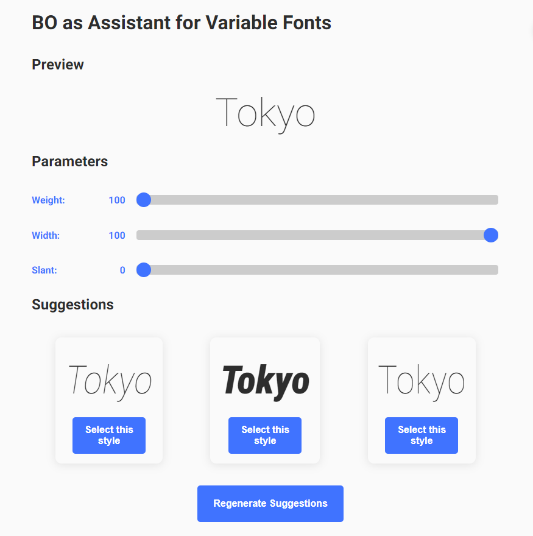

# bo-as-assistant-for-vf



This is a demo for BO as Assistant (Koyama+, UIST 2022) for Variable Fonts.

BO as Assistant is a framework that supports a design process leveraging Bayesian optimization.

In this demo, it is applied to a task of adjusting the parameter of variable fonts.

## How to run

1. Install dependencies using Rye [[install](https://rye-up.com/guide/installation/)]
```bash
$ rye sync
```

2. Run a demo
```bash
$ rye run flask run
```

## Reference
Yuki Koyama and Masataka Goto. 2022. BO as Assistant: Using Bayesian Optimization for Asynchronously Generating Design Suggestions. In Proceedings of the 35th Annual ACM Symposium on User Interface Software and Technology (UIST '22). Association for Computing Machinery, New York, NY, USA, Article 77, 1–14. https://doi.org/10.1145/3526113.3545664

